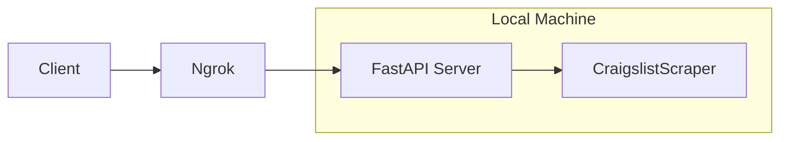

# Scraper Server Implementation Plan

## Architecture Overview



## Implementation Steps

### 1. Set Up FastAPI Server
- Add new dependencies to requirements.txt:
  ```
  fastapi>=0.100.0
  uvicorn>=0.25.0
  pyngrok>=7.0.0
  pydantic>=2.0.0
  ```
- Create `server.py` in scraper directory
- Implement REST endpoints:
  - POST `/scrape`: Accept URLs and return scraping results
  - GET `/health`: Basic health check endpoint

### 2. Server Implementation Details
- FastAPI application setup
- Error handling and request validation
- Single CraigslistScraper instance initialization
- JSON response schema definitions
- API request logging integration
- Request/Response models using Pydantic

### 3. ngrok Integration
- ngrok installation and setup
- Configuration file setup
- Startup script creation:
  1. FastAPI server launch
  2. ngrok tunnel establishment

### 4. Security Measures
- Rate limiting implementation
- Basic authentication (optional)
- Request validation
- CORS policy configuration

## API Endpoints Specification

### POST /scrape
Request body:
```json
{
  "urls": ["url1", "url2"],
  "max_retries": 3
}
```

Response:
```json
{
  "results": [
    {
      "url": "url1",
      "data": { ... },
      "success": true
    }
  ],
  "errors": []
}
```

### GET /health
Response:
```json
{
  "status": "healthy",
  "timestamp": "2024-04-19T19:23:00Z"
}
```

## Next Steps
1. Implement FastAPI server with basic endpoints
2. Add security features
3. Set up ngrok integration
4. Create startup script
5. Test and document API usage